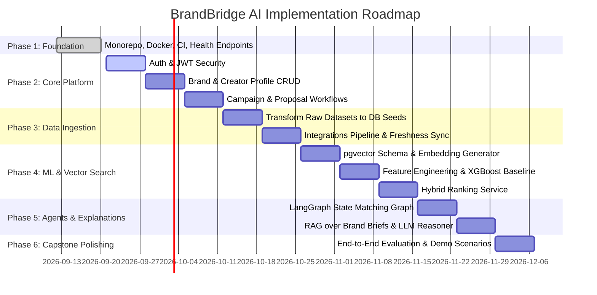

# BrandBridge AI — Technical Implementation Guide

This document provides a comprehensive, step-by-step guide to the technical implementation of **BrandBridge AI**, the detailed role of each technology in the stack, and a phased execution plan for development.

---

## Table of Contents
1. [End-to-End Technical Implementation](#1-end-to-end-technical-implementation)
2. [Role of Each Tech Stack Component](#2-role-of-each-tech-stack-component)
3. [Step-by-Step Execution Plan (Phased Roadmap)](#3-step-by-step-execution-plan-phased-roadmap)
4. [Architecture Principles & Engineering Guardrails](#4-architecture-principles--engineering-guardrails)

---

# 1. End-to-End Technical Implementation

To understand how the entire system functions, here is the end-to-end data lifecycle of a primary user journey: **A Brand manager submits a campaign brief, the system matches and ranks creators using hybrid ML and semantic search, synthesizes an explainable match rationale, and allows the brand to review and dispatch a collaboration proposal.**

```text
[Browser UI] ──▶ [FastAPI API] ──▶ [Service Layer] ──▶ [LangGraph Orchestrator]
                                                              │
                     ┌────────────────────────────────────────┼──────────────────────────────────┐
                     ▼                                        ▼                                  ▼
             [Structured SQL]                          [Hybrid ML Model]                  [Semantic Search]
       (PostgreSQL 16 Tables)                       (XGBoost / Tabular)                 (pgvector Cosine Sim)
                     │                                        │                                  │
                     └────────────────────────────────────────┼──────────────────────────────────┘
                                                              ▼
                                                 [RAG & LLM Explainer]
                                              (Brand Guidelines + Prompt)
                                                              │
                                                              ▼
                                                   [Human Approval Gate]
                                                              │
                                                              ▼
                                                 [Create & Persist Proposal]
```

### Stage 1: Client Ingress & User Interaction (React Frontend)
1. The brand manager navigates to the campaign creation view (`frontend/src/pages/CampaignDetailPage.tsx`).
2. They input:
   - **Structured Criteria:** Target platform (`youtube`), follower tier (`50k–200k`), max budget per post (`$1,500`), target demographics.
   - **Unstructured Campaign Brief:** *"Looking for fitness and wellness creators promoting clean plant-based protein with high audience engagement."*
3. **TanStack Query** dispatches an asynchronous HTTP `POST` request to `/api/v1/recommendations` with the payload.

### Stage 2: Ingress Validation & Routing (FastAPI + Pydantic v2)
1. The FastAPI router (`backend/app/api/v1/`) intercepts the incoming request.
2. **Pydantic v2 schemas** (`backend/app/schemas/`) parse and validate types, boundaries, and required fields before any business logic executes.
3. Once validated, the route invokes the orchestration method in the Service Layer (`backend/app/services/`).

### Stage 3: Workflow Orchestration (LangGraph Agent)
1. The service layer instantiates a creator-matching state graph (`backend/app/ai/agents/`).
2. The graph executes sequential, deterministic nodes:
   - **Node 1 (Hard Filtering):** Queries PostgreSQL via SQLAlchemy repositories for creators satisfying non-negotiable constraints (platform, follower boundaries, budget limits).
   - **Node 2 (Live Metrics Ingestion):** Checks metric freshness; calls integration modules (`backend/app/integrations/`) for YouTube, Instagram, or Bluesky if metrics require refreshing.

### Stage 4: Hybrid Scoring (Tabular ML + Semantic Search)
1. **Semantic Vector Search (`pgvector` + `sentence-transformers`):**
   - The brief text is converted into a 384-dimensional dense vector using `all-MiniLM-L6-v2`.
   - `pgvector` computes the cosine distance (`<=>`) against creator bio and content embeddings in PostgreSQL.
   - Generates a **Semantic Match Score** ($0.0 \to 1.0$).
2. **Tabular Machine Learning Scoring (XGBoost / Scikit-Learn):**
   - The candidate's structured tabular features are passed to the inference module (`backend/app/ml/inference/`):
     - Engagement Rate ($\frac{\text{Likes} + \text{Comments}}{\text{Views}}$)
     - Budget Efficiency (Cost per 1k views)
     - Audience Alignment Ratio
     - Content Cadence (Upload consistency)
   - Generates an **ML Score** ($0.0 \to 1.0$).
3. **Ensemble Ranker:**
   - Computes the combined weighted score:
     $$\text{Final Score} = (\alpha \times \text{ML Score}) + (\beta \times \text{Semantic Score})$$

### Stage 5: RAG & Explainable AI Generation
1. For top candidates, the LangGraph node runs **RAG** (`backend/app/ai/rag/`):
   - Queries `pgvector` for chunks of the brand's tone guidelines and brief parameters.
2. The LLM provider (via LangChain in `backend/app/ai/llm/`) generates an **Explainability Summary**:
   - *"Matched because: 82% audience alignment with fitness demographic; consistent upload frequency (3 videos/week); previous sponsorships in nutrition niche."*

### Stage 6: Human-in-the-Loop & Proposal Lifecycle
1. The ranked creators and explainability summaries are returned to the React frontend.
2. The Brand Manager reviews matches on `frontend/src/pages/RecommendationsPage.tsx`.
3. **Human Approval:** The user clicks **"Send Collaboration Proposal"**.
4. The frontend calls `POST /api/v1/proposals`.
5. The backend records a proposal in the `proposals` table with status `PENDING` and dispatches notification events.

---

# 2. Role of Each Tech Stack Component

| Technology | Layer | Role in BrandBridge AI | Key Value |
| :--- | :--- | :--- | :--- |
| **React 18 + TypeScript** | Frontend UI | Single-page application, brand/creator dashboards, proposal reviews, search filters. | Type safety matching backend Pydantic models; reusable components. |
| **Vite** | Build Tool | Dev server (`localhost:5173`) and frontend bundler. | Instant Hot Module Replacement (HMR) and optimized build outputs. |
| **TanStack Query** | Data Fetching | Manages async server state, caching, background refetching, and mutation states. | Eliminates boilerplate `useEffect` hooks and prevents out-of-sync UI state. |
| **React Router DOM** | Client Routing | Declarative routing across 11 views with role-based route guards (`BRAND` vs `CREATOR`). | Clean URL state management and protected navigation. |
| **FastAPI (Python 3.12)** | Backend API | High-performance asynchronous REST API (`localhost:8000`) with auto-generated OpenAPI docs. | Native async support, high throughput, and automatic Swagger docs at `/docs`. |
| **Pydantic v2** | Data Contracts | Request/response schemas, type coercion, and validation rules. | High-speed Rust-based parsing; validates data before reaching services. |
| **SQLAlchemy 2** | ORM / Persistence | Declarative models (`User`, `Campaign`, `Proposal`) and repository queries. | Type-safe queries using SQLAlchemy 2 `select()` style with session isolation. |
| **PostgreSQL 16** | Relational Database | Central source of truth for marketplace data, accounts, campaigns, and proposals. | ACID compliance, strong consistency, and relational integrity. |
| **`pgvector`** | Vector Engine | PostgreSQL extension storing vector embeddings (`vector(384)`) for semantic search. | Eliminates a separate vector database; enables single-query hybrid SQL + vector search. |
| **Alembic** | DB Migrations | Version-controlled schema migrations for relational tables and vector indexes. | Reproducible database structure across environments and CI/CD pipelines. |
| **sentence-transformers** | Embeddings | Generates 384-dimensional dense vectors using `all-MiniLM-L6-v2`. | Runs locally on CPU without paid third-party API quotas; fast and consistent. |
| **XGBoost / Scikit-learn** | Tabular ML | Computes compatibility scores from structured engagement, reach, and budget metrics. | High accuracy on tabular data; provides feature importance for interpretability. |
| **LangChain** | LLM Abstraction | Standardized interface for prompt templates, output parsers, and LLM calls. | Decouples provider choice (Gemini, OpenAI); enforces structured outputs. |
| **LangGraph** | Agent Workflows | Orchestrates stateful matching pipelines, branching logic, and human approval gates. | Cyclic graph execution allows state management and halting at approval gates. |
| **Social Data Collectors** | Ingestion Layer | Modular collectors for YouTube (v3 API), Instagram (Graph API), and Bluesky (AT Protocol). | Standardizes creator data without making third-party APIs a runtime bottleneck. |
| **Docker Compose** | Infrastructure | Runs `brandbridge-frontend`, `brandbridge-backend`, and `brandbridge-postgres`. | Consistent local development environment with zero host machine dependencies. |
| **GitHub Actions** | CI Pipeline | Runs Ruff linting, frontend builds, and backend pytest suites on every PR. | Enforces code quality and catches regressions before merging to `main`. |

---

# 3. Step-by-Step Execution Plan (Phased Roadmap)



### Phase 1: Engineering Foundation *(Completed)*
- [x] Monorepo structure (`frontend/`, `backend/`, `data/`, `docs/`).
- [x] Docker Compose with PostgreSQL 16 + `pgvector`.
- [x] FastAPI application shell with health endpoints.
- [x] React 18 application shell with Vite and basic router.
- [x] Social data ingestion collectors for YouTube, Instagram, and Bluesky.
- [x] Sample datasets committed under `data/raw/`.

---

### Phase 2: Core Platform & Entity Workflows (Weeks 1–3)
*Goal: Working CRUD marketplace with authentication.*

1. **Authentication & Authorization (`backend/app/core/`):**
   - Implement password hashing with bcrypt and JWT token generation (`security.py`).
   - Create auth routes: `POST /api/v1/auth/register` and `POST /api/v1/auth/login`.
   - Add route dependencies: `get_current_user`, `require_role("BRAND")`, `require_role("CREATOR")`.
2. **Profile Management (`backend/app/services/` & `repositories/`):**
   - Implement profile CRUD operations for both Brands and Creators.
   - Connect frontend registration and profile forms to backend endpoints.
3. **Campaign & Proposal Workflows:**
   - Implement `/api/v1/campaigns` (Brands create briefs, view campaign listings).
   - Implement `/api/v1/proposals` (Brands invite creators, creators accept/reject).
4. **Database Migrations:**
   - Generate initial Alembic migration (`alembic revision --autogenerate -m "create_core_tables"`).

---

### Phase 3: Data Ingestion & Seeding Pipeline (Weeks 3–5)
*Goal: Populate database with realistic creator profiles from collected data.*

1. **Transform Raw Ingested Data:**
   - Build a seed utility script (`scripts/seed_creators.py`).
   - Parse datasets from `data/raw/youtube/`, `data/raw/instagram/`, and `data/raw/bsky/`.
   - Map JSON payloads to the unified `CreatorProfile` SQLAlchemy model.
2. **Failure-Tolerant Social Ingestion:**
   - Ensure external API collectors handle rate limits gracefully without blocking application workflows.
   - Fall back to stored database records if an external social API fails.

---

### Phase 4: Hybrid ML Scoring & Vector Search (Weeks 5–7)
*Goal: Build deterministic scoring and semantic retrieval.*

1. **Embeddings Pipeline (`backend/app/ai/embeddings/`):**
   - Apply migration enabling `pgvector` extension and adding `embedding vector(384)`.
   - Batch-generate embeddings for creator bios using `sentence-transformers`.
2. **Feature Engineering & Tabular ML (`backend/app/ml/`):**
   - Extract tabular features (engagement rate, cost efficiency, upload cadence).
   - Train baseline models (Logistic Regression, Random Forest, XGBoost) in notebooks.
   - Serialize model artifacts to `backend/app/ml/artifacts/`.
   - Implement `predict_compatibility()` in `backend/app/ml/inference/`.
3. **Hybrid Ranker Service:**
   - Combine metadata SQL filters, vector similarity, and XGBoost score into a single ranking service.

---

### Phase 5: LangGraph Agent & RAG Explainability (Weeks 7–9)
*Goal: Add agentic reasoning, RAG, and Human-in-the-Loop workflows.*

1. **Implement Modular LangGraph Nodes (`backend/app/ai/agents/`):**
   - `parse_campaign_brief`
   - `filter_candidates`
   - `compute_hybrid_score`
   - `retrieve_brand_guidelines`
   - `generate_match_explanation`
2. **RAG for Brand Knowledge (`backend/app/ai/rag/`):**
   - Chunk brand guidelines and campaign briefs; store chunks in `pgvector`.
   - Retrieve top matching guideline sections to supply context for match rationales.
3. **Human Approval Enforcement:**
   - The AI prepares proposals but never dispatches them automatically. Proposals require explicit brand user approval on the UI.

---

### Phase 6: End-to-End Integration, Validation & Demo (Weeks 9–10)
*Goal: Final testing, performance optimization, and capstone presentation.*

1. **Frontend Integration:**
   - Connect `RecommendationsPage.tsx` to live backend recommendation endpoints.
   - Display match breakdowns (Niche Fit, Engagement Score, Budget Alignment).
2. **Performance Benchmarking:**
   - Verify `pgvector` ANN searches complete in $< 50\text{ ms}$ using HNSW indexing.
   - Ensure automated test suites pass cleanly across backend and frontend.
3. **Capstone Demo Walkthrough (`docs/demo-scenario.md`):**
   - Demonstrate the end-to-end scenario: brand registration, brief submission, explainable AI recommendation, human approval, and proposal acceptance.

---

# 4. Architecture Principles & Engineering Guardrails

1. **Modular Monolith First:** No premature microservices, message queues (Kafka), or separate cache tiers (Redis) unless approved.
2. **PostgreSQL as Single Source of Truth:** All structured marketplace data and vector embeddings live inside PostgreSQL with `pgvector`.
3. **Deterministic Code Over LLM Calls:** Prefer mathematical scoring and SQL filtering over LLM calls wherever deterministic logic suffices.
4. **RAG for Unstructured Knowledge Only:** Use RAG exclusively for guidelines, briefs, and portfolios; never for relational queries (e.g., finding user by ID).
5. **Human Approval on High-Impact Actions:** Sending invitations, submitting proposals, and approving collaborations must always require human confirmation.
6. **Social APIs are Optional:** Social media collectors must fail gracefully without halting core platform features.
